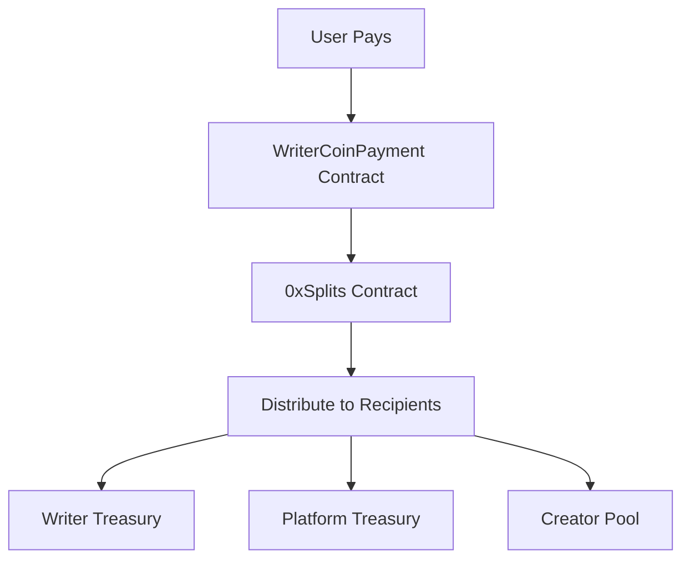
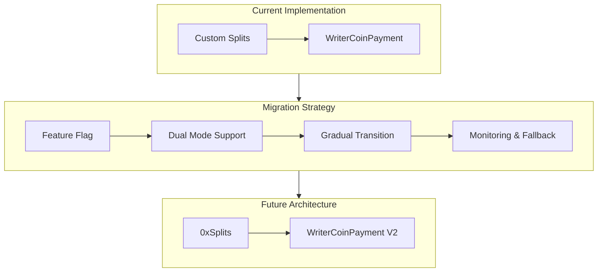

# Payment Architecture Strategic Recommendations

## Current Approach Analysis

### Pros of Custom Splits Implementation
- ✅ **Full control** over revenue distribution logic
- ✅ **No external dependencies** - self-contained system
- ✅ **Customizable** for specific business requirements
- ✅ **Already implemented** and ready for deployment

### Cons of Custom Splits Implementation
- ❌ **Reinventing the wheel** - splits logic is complex and error-prone
- ❌ **Audit burden** - need to thoroughly audit custom splits implementation
- ❌ **Maintenance overhead** - must handle edge cases and updates
- ❌ **No standardization** - each platform implements splits differently

## 0xSplits Alternative Analysis

### What is 0xSplits?
0xSplits is an audited, battle-tested protocol for managing revenue splits:
- **Audited contracts** with proven security
- **Standardized interface** for splits management
- **Flexible configurations** for different distribution models
- **Widely adopted** in the ecosystem

### Benefits of Using 0xSplits
- ✅ **Proven security** - audited by multiple firms
- ✅ **Reduced development time** - no need to build splits logic
- ✅ **Standardized approach** - familiar to users and developers
- ✅ **Flexible configurations** - can handle complex distributions
- ✅ **Gas optimized** - efficient splits processing
- ✅ **Future-proof** - updates handled by 0xSplits team

### Integration Approach

## Strategic Recommendations

### Phase 1: MVP Launch (Current Approach)
**Recommendation**: **Proceed with current custom implementation for MVP**

**Rationale**:
- ✅ **Speed to market** - contracts are ready now
- ✅ **Control** - can adjust splits as needed for launch partners
- ✅ **Simplicity** - no external dependencies for initial launch
- ✅ **Focus** - avoid scope creep during critical launch phase

**Implementation**:
1. Deploy current WriterCoinPayment contract
2. Use hardcoded splits for initial launch partners (Fred Wilson/AVC)
3. Monitor and audit the splits logic thoroughly
4. Document all revenue flows clearly

### Phase 2: Post-MVP Evolution (3-6 months)
**Recommendation**: **Transition to 0xSplits for long-term sustainability**

**Rationale**:
- ✅ **Security** - leverage audited contracts
- ✅ **Standardization** - align with industry best practices
- ✅ **Scalability** - handle more complex distributions
- ✅ **User empowerment** - allow creators to set their own splits

**Migration Path**:
1. **Research**: Deep dive into 0xSplits architecture
2. **Design**: Create migration strategy from custom to 0xSplits
3. **Implement**: Build integration layer with fallback
4. **Test**: Thoroughly test with existing users
5. **Deploy**: Gradual rollout with monitoring

## Hybrid Approach Consideration

**Option**: Use custom splits for MVP, but design for 0xSplits compatibility

## Decision Framework

| Factor | Custom Splits | 0xSplits | Recommendation |
|--------|--------------|----------|----------------|
| **Time to Launch** | ✅ Fast | ❌ Slower | **Custom for MVP** |
| **Security** | ❌ Need audit | ✅ Audited | **0xSplits long-term** |
| **Flexibility** | ✅ Full control | ✅ Standardized | **Both work** |
| **Maintenance** | ❌ High | ✅ Low | **0xSplits better** |
| **User Experience** | ✅ Simple | ✅ Familiar | **Similar** |
| **Ecosystem** | ❌ Proprietary | ✅ Standard | **0xSplits better** |

## Implementation Roadmap

### Immediate Actions (Next 2 weeks)
1. **Deploy current contracts** with custom splits
2. **Document revenue flows** clearly for transparency
3. **Monitor transactions** for any splits issues
4. **Gather user feedback** on payment experience

### Medium-term (3-6 months)
1. **Research 0xSplits** integration options
2. **Design migration** strategy
3. **Build test implementation** with 0xSplits
4. **Create fallback** mechanism

### Long-term (6-12 months)
1. **Migrate to 0xSplits** for new users
2. **Phase out custom** splits for existing users
3. **Enable user-defined** splits configurations
4. **Expand to more** writer coins and distributions

## Key Questions for Decision

1. **What's the launch timeline?** (Tight = custom, Flexible = 0xSplits)
2. **What's the risk tolerance?** (High = custom, Low = 0xSplits)
3. **What's the maintenance capacity?** (Limited = 0xSplits)
4. **What's the ecosystem strategy?** (Standardization = 0xSplits)

## Final Recommendation

**Proceed with current custom splits for MVP launch, but plan migration to 0xSplits within 6 months.**

This approach:
- ✅ Gets product to market quickly
- ✅ Maintains control during critical launch phase
- ✅ Provides path to more secure, standardized solution
- ✅ Allows time for proper 0xSplits integration design
- ✅ Balances speed vs. long-term sustainability

The current implementation is sufficient for launch, but 0xSplits should be the long-term target for better security, standardization, and maintainability.