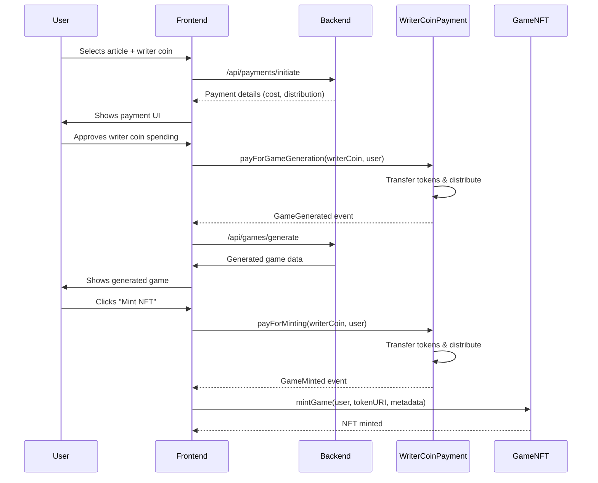
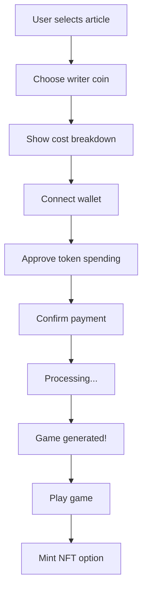

# Writer Coin Payment System Analysis & Deployment Strategy

## Current System Architecture

### 1. Contract Structure
- **WriterCoinPayment.sol**: Core payment processing contract
- **GameNFT.sol**: NFT minting contract
- **StoryIPAuthor.sol**: IP registration contract

### 2. Payment Flow


### 3. Revenue Distribution
- **Game Generation**: 60% writer, 20% platform, 20% creator pool
- **NFT Minting**: 50% creator/user, 30% creator, 15% writer, 5% platform

## Current Deployment Status

### Contracts
- ✅ **WriterCoinPayment.sol**: Ready for deployment
- ✅ **GameNFT.sol**: Ready for deployment
- ❌ **StoryIPAuthor.sol**: Not integrated with payment flow

### Configuration
- ✅ **AVC Token**: `0x06FC3D5D2369561e28F261148576520F5e49D6ea` (Base mainnet)
- ❌ **Platform Treasury**: Not set
- ❌ **Creator Pool**: Not set
- ❌ **Writer Treasury**: Not set (Fred Wilson)

### Deployment Phases

## Phase 1: Base Sepolia Testnet (Current Focus)

### Step 1: Deploy Core Contracts
```bash
# Deploy GameNFT
npx hardhat run scripts/deploy-game-nft.ts --network base-sepolia

# Deploy WriterCoinPayment
npx hardhat run scripts/deploy-writer-coin-payment.ts --network base-sepolia \
  --platform-treasury 0x... \
  --creator-pool 0x...
```

### Step 2: Whitelist AVC Coin
```solidity
// Call on WriterCoinPayment contract
whitelistCoin(
  "0x06FC3D5D2369561e28F261148576520F5e49D6ea", // AVC Base Sepolia
  100 * 10^18, // 100 AVC for game generation
  50 * 10^18,  // 50 AVC for minting
  "0xFredWilsonTreasury", // Writer treasury
  6000, // 60% writer share (game)
  2000, // 20% platform share (game)
  2000  // 20% creator pool share (game)
)
```

### Step 3: Update Environment Variables
```env
NEXT_PUBLIC_WRITER_COIN_PAYMENT_SEPOLIA=0x...
NEXT_PUBLIC_GAME_NFT_SEPOLIA=0x...
```

## Phase 2: Base Mainnet (Week 5)

### Step 1: Deploy to Mainnet
```bash
# Same deployment process as Sepolia
npx hardhat run scripts/deploy-game-nft.ts --network base-mainnet
npx hardhat run scripts/deploy-writer-coin-payment.ts --network base-mainnet
```

### Step 2: Update Mainnet Addresses
```env
NEXT_PUBLIC_WRITER_COIN_PAYMENT_MAINNET=0x...
NEXT_PUBLIC_GAME_NFT_MAINNET=0x...
```

## Product Design Recommendations

### 1. Payment UX Flow


### 2. Cost Transparency
- **Show exact token amounts** (100 AVC = $X.XX)
- **Display revenue distribution** (60% to writer, etc.)
- **Gas fee estimates** before confirmation

### 3. Error Handling
- **Insufficient balance**: "You need X more AVC tokens"
- **Transaction failed**: "Payment failed, try again"
- **Network issues**: "Base network congestion, retrying..."

### 4. Success States
- **Game generation**: "Game created! 60 AVC sent to Fred Wilson"
- **NFT minting**: "NFT minted! 50 AVC to creator, 30 AVC to creator pool, 15 AVC to writer"

## Security Considerations

### 1. Reentrancy Protection
- ✅ Already implemented via `ReentrancyGuard`

### 2. Access Control
- ✅ Owner-only functions for configuration
- ✅ Zero address validation

### 3. Token Validation
- ✅ ERC20 interface validation
- ✅ Transfer success verification

## Next Steps

1. **Deploy contracts** to Base Sepolia testnet
2. **Test payment flow** end-to-end
3. **Verify token distribution** matches expected shares
4. **Integrate with frontend** payment UI
5. **Deploy to Base mainnet** (Week 5)

## Open Questions

1. **Writer Treasury Address**: Need Fred Wilson's actual treasury address
2. **Platform Treasury**: Which multisig/wallet to use?
3. **Creator Pool**: Should this be a separate contract or wallet?
4. **Gas Optimization**: Should we batch multiple payments?